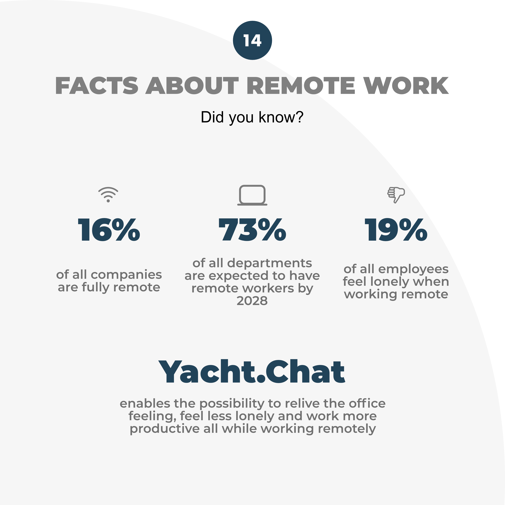

🎅Day 14/24 of our Christmas countdown 🎄

Did you know that already 16% of all companies around the world are fully-remote? 🤯

Since 2009, the number of people who work from home has risen by 159% and the trend is not going to stop so quickly. By 2028, 73% of all departments are expected to have remote workers. That shows that telecommuting will become more and more acceptable even across a wide range of industries 📈

But, such a big and rapid trend change in how we work doesn’t come without challenges. Many employees have a problem with the loneliness (19%) and less communication/collaboration with their colleagues (17%) that comes with the remote work 🤐

We at Yacht.Chat are tackling exactly these challenges and enable the possibility to relive the office feeling while working remotely 👩‍💻🧑‍💻

❗️Stay tuned for day 15. We will post every day something for you until Christmas❗️ 