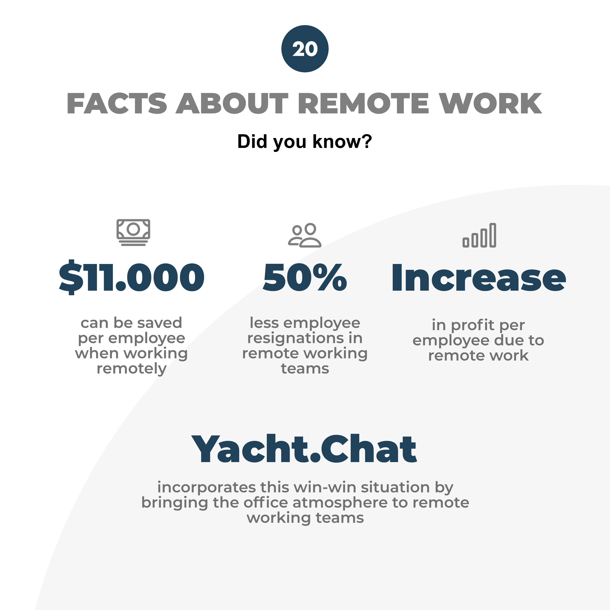

🎅Day 20/24 of our Christmas countdown 🎄

Did you know that remote work has financial benefits for your company and your employees? 🤯

Different studies show that employees and employers can save up to 11.000$ a year. For employees, these savings are related to food, clothing, transit and more. For employers, these cost savings include for example office overhead costs or the rent 💵

In addition to the cost savings, it was also found that resignations dropped by 50% when there was an option for employees to work remotely and the average profit per employee increased 📈

Remote work is a win-win situation for employers and employees. Why do you or don’t work remotely? 👩‍💻🧑‍💻

❗️Stay tuned for day 21. We will post every day something for you until Christmas❗️ 